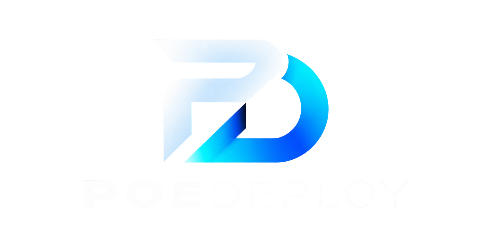

# PoeDeploy

<p align="center">
  
</p>

PoeDeploy is a personal automated post-installation setup script for Arch Linux.

The goal of this project is to make a fresh Arch Linux installation reproducible without creating a complete custom Arch ISO.

PoeDeploy detects the existing system and installs and configures only what is required.

## Current Features

- Arch Linux detection
- First-run setup and selectable sections for repeat runs
- Internet connectivity check
- Active Pacman operation waiting and stale database-lock recovery
- Full system update
- `yay` installation
- Base system and network tools
- GPU detection
- NVIDIA open DKMS driver detection/installation
- Bootloader detection
- Optional UKI creation for systemd-boot installations
- Existing boot images and loader entries retained as recovery options
- UKI boot verification before Secure Boot configuration
- Persistent plain-black UKI splash across kernel upgrades
- NetworkManager detection and configuration
- Filesystem detection
- Plymouth installation and configuration
- Interactive Plymouth theme selection
- Plymouth theme discovery from the PoeDeploy repository
- Initramfs and UKI rebuilding after a theme change
- Generated UKI inspection for Plymouth hook order, theme, command line and firmware splash
- Official PoeDeploy Plymouth theme
- Timeshift installation
- Optional ML4W installation
- Optional SDDM installation and configuration
- Interactive application selection
- Cancel, skip or retry individual optional application installations with Ctrl+C
- Interactive default-browser selection
- Official Arch repositories preferred
- AUR fallback when required
- VLC plugin installation
- Tailscale installation
- Tailscale service configuration
- Optional Secure Boot setup with `sbctl`
- Explicit Secure Boot key creation, enrollment and signing confirmations
- Microsoft certificate preservation during key enrollment
- systemd-boot and UKI signing and verification
- Optional SMB share configuration
- Optional NFS share configuration
- Persistent `/etc/fstab` entries for network shares
- Idempotent installation

## Requirements

- Arch Linux
- Internet connection
- `sudo` access
- UEFI with systemd-boot for automated UKI setup
- UEFI Setup Mode when enrolling new Secure Boot keys

## Applications

The optional application menu currently includes:

- 7-Zip
- Discord
- Firefox
- GIMP
- LibreOffice
- LocalSend
- OBS Studio
- PowerTOP
- Spotify
- Tailscale
- Thunderbird
- Visual Studio Code
- VLC

Applications are selected interactively before installation.

When VLC is selected, the VLC plugin package is also installed.

Timeshift is available as its own setup section.

During an optional application's installation, press **Ctrl+C** once. After the
package manager or AUR build exits, PoeDeploy offers **Skip**, **Retry**, or
**Quit**. Skip continues with the next package; Retry attempts the same package;
Quit stops PoeDeploy. Skipped packages appear separately from failures in the
summary and can be selected again on a later run.

Cancellation does not roll back changes or uninstall dependencies that have
already been installed. The package manager may need time to finish its current
transaction and exit. This skip prompt applies to optional app installations;
Ctrl+C elsewhere retains its normal stop behaviour. Skipping VLC also skips its
plugins, and skipping Tailscale prevents its service section from reinstalling it.

## Package Sources

The script follows this priority:

1. Official Arch Linux repositories
2. AUR when the package is not available in the official repositories

`yay` is used as the AUR helper.

## Plymouth Themes

PoeDeploy-managed themes use the following repository layout:

```text
themes/<theme-name>/plymouth/<theme-name>.zip
```

Themes matching this structure are detected automatically. PoeDeploy does not download third-party theme collections at runtime. Any curated theme must first be added to this repository using the structure above.

## UKI and Secure Boot

On UEFI systems using systemd-boot, PoeDeploy can create a normal UKI for each installed kernel under the boot partition's `EFI/Linux` directory. It discovers the boot partition with `bootctl`, preserves the existing kernel arguments, adds the options required by Plymouth, backs up an existing `/etc/kernel/cmdline`, and keeps the existing traditional initramfs and loader entries intact. The proposed persistent command line is displayed with an explanation before the privileged write.

After generating the UKIs, PoeDeploy verifies that they are PE executables and asks for a reboot through the new UKI entry. Secure Boot configuration remains blocked until a later run confirms that the current system was successfully booted from a UKI. Mkinitcpio preset backups are stored beside the originals with the `.poedeploy.bak` suffix.

Secure Boot configuration is optional and uses `sbctl`. PoeDeploy requires separate typed confirmation before creating keys, enrolling keys, or signing EFI files. New key enrollment is only attempted when the firmware reports Setup Mode, and Microsoft certificates are included with `sbctl enroll-keys --microsoft`.

PoeDeploy builds configured UKIs before signing systemd-boot and the final UKIs, then runs `sbctl verify`. Firmware configuration and recovery knowledge are still the administrator's responsibility.

The UKI contains two distinct splash stages. Its PE `.splash` section is a static
firmware image shown by `systemd-stub`; PoeDeploy replaces the default Arch image
with plain black. Plymouth is stored inside the UKI's embedded initramfs and then
shows the selected animated theme. Building or signing a UKI does not replace the
Plymouth theme.

PoeDeploy updates an existing native `<preset>_splash` setting (including an
override of `ALL_splash`), or uses `<preset>_options="--splash ..."` when native
splash settings are absent. It removes duplicate splash options while keeping
unrelated options and other presets intact. It places `plymouth` after `systemd` or
`udev` in the hook list, and refreshes an already-installed PoeDeploy theme from
the current release. After building, it inspects each UKI and refuses Secure Boot
signing when the selected theme, `splash` kernel option or hook order is wrong, or
when the default Arch firmware splash remains embedded.

A Plymouth run selects the theme before rebuilding boot images once. Keeping the
current theme still rebuilds to apply refreshed assets and boot parameters. Build
or verification failures stop the run with an error instead of reporting success
or recommending a reboot. UKI extraction failures are reported separately from a
missing `splash` kernel argument.

Rebuilding a UKI changes its signed contents. When firmware Secure Boot is already
enabled, the mkinitcpio `sbctl` post-hook signs the rebuilt image and PoeDeploy runs
`sbctl verify` afterward. The full key creation and enrollment section runs only
when the user explicitly selects Secure Boot.

Signature verification reads `sbctl --json verify` per-file results: a successful
command exit alone does not mean all files are signed. A Plymouth rebuild requires
every configured active UKI to have a signed result. With systemd-boot, it also
checks the current loader and fallback copies identified by `bootctl` on the ESP.
The Secure Boot setup section registers and signs these identified copies,
including `EFI/BOOT/BOOTX64.EFI`. PoeDeploy does not register or separately sign
standalone `/boot/vmlinuz-*` kernels; its signing commands target bootloaders and UKIs.
After an already-enabled Secure Boot system rebuilds its UKIs, PoeDeploy can also
automatically sign and register an unsigned identified systemd-boot fallback. It
first verifies the active loader and current UKI against the existing signing key
and confirms the current UKI's Plymouth configuration. It never signs an unknown
fallback merely because its filename matches, and does not reopen key enrollment.
It verifies the fallback again after signing; a failure remains a separate warning
without claiming that fallback protection passed.
Other unsigned files are reported separately. On a verified UKI boot, the unsigned
standalone `/boot/vmlinuz-*` kernel is informational because it is outside that boot
chain; it remains a failure if explicitly included among required files.
The report identifies the active loader and current UKI by path, verifies the
persistent kernel arguments embedded in the UKI, and reports fallback and standalone
kernel signatures separately. Standalone kernel signatures are reported only.
The summary separates Secure Boot setup, signature verification, boot image rebuilds,
and automatic fallback signing. Signing a standalone kernel does not authenticate
an external initramfs or command line; the signed UKI remains the intended boot path.

If the summary reports **keys created but not enrolled**, use the firmware's
documented procedure to enter Secure Boot Setup Mode. Custom mode by itself may
not enable Setup Mode; check using `sudo sbctl status` after returning to Arch.
Rerun PoeDeploy, answer **yes** to the previous-run question, and select only
**Secure Boot** to complete enrollment and signing. Existing key files are not
treated as proof of enrollment: when Setup Mode is disabled, PoeDeploy asks
whether those exact keys have already been enrolled before proceeding to sign.

If the UKI reboot test is still pending, first boot through the UKI entry and then
rerun the Secure Boot section. After enrollment and signing, check
`sudo sbctl status` and `sudo sbctl verify` before enabling Secure Boot enforcement
in firmware. See the [sbctl workflow](https://github.com/Foxboron/sbctl/blob/master/docs/sbctl.8.txt).

## Network Shares

The installer can optionally configure:

- SMB/CIFS shares
- NFS shares

Local mount points are created automatically and persistent entries can be added to /etc/fstab.

## Usage

Run the latest stable release with the public bootstrapper:

```bash
bash <(curl -fsSL https://cyberpoe.uk/latest-release)
```

The bootstrapper verifies that it is running on Arch Linux, installs Git when
needed, finds the highest stable version tag in the GitHub repository, displays
the selected version, and downloads it into a temporary directory. Temporary
files are removed automatically when PoeDeploy exits.

Alternatively, clone the [PoeDeploy repository](https://github.com/cyberpoe-uk/PoeDeploy), make the script executable, and run it:

```bash
git clone https://github.com/cyberpoe-uk/PoeDeploy.git
cd PoeDeploy
chmod +x poedeploy.sh
./poedeploy.sh
```

## First and subsequent runs

At startup PoeDeploy asks:

```text
Have you run PoeDeploy before on this Arch installation? [y/N]:
```

Answer **no** for the complete setup, including the existing optional prompts.
Answer **yes** to choose specific sections. This also works after an interrupted
first run; there is no requirement for a previous run to have completed.

The repeat-run menu starts with no sections selected. When `gum` is already
installed and you are using an interactive terminal, it uses the same blue
checklist as the application selector: **↑/↓** to navigate, **x** to toggle,
**Enter** to continue, and **Esc/Ctrl+C** to cancel. Choosing nothing does not
start an installation. PoeDeploy does not install anything just to display this
startup menu, before you have confirmed the run.

Without `gum` or an interactive terminal, the numbered menu remains available.
Enter numbers separated by
spaces or commas to toggle them, `all` or `none` to change the whole selection,
`run` to proceed, or `quit` to leave before making system changes. For example:

```text
Selection: 15
Selection: run
```

This selects only **Secure Boot**. Option **11** selects optional applications;
on repeat runs its application checklist also starts with nothing selected.
Cancelling the application checklist skips optional applications; other selected
setup sections can still continue. First-run application selection still starts
with all applications selected.

The sections are system update, yay, base tools, GPU drivers, NetworkManager,
Plymouth, UKI, Timeshift, ML4W, SDDM, applications, default browser, SMB/NFS shares,
Tailscale service, and Secure Boot. Selected sections run in dependency order.
System detection is read-only. Unselected sections do not run; in particular a
Secure Boot-only run does not perform a full update, install desktop applications,
or change Plymouth. Missing packages required by a selected section may still be
installed, and the Secure Boot section still rebuilds and signs the configured UKIs.

## Development checks

```bash
bash -n poedeploy.sh
python3 -m unittest discover -s tests -v
```

The tests use mocked privileged operations and a harmless package-process fixture
in a pseudo-terminal to exercise real Ctrl+C handling. They do not install
packages, change firmware, or rebuild this machine's boot images.

## ML4W

ML4W is optional and is installed using the official ML4W installer:

```bash
bash <(curl -fsSL https://ml4w.com/os/stable)
```
