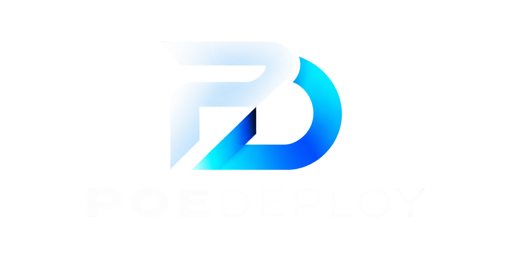

# PoeDeploy

<p align="center">
  
</p>

## Set up Arch Linux, or just the part you need

I made PoeDeploy to help me set up my Arch Linux machines without having to
remember every command each time. It can guide you through a full setup, but you
do not have to use it that way.

You can also open PoeDeploy when you only want help with one job, such as:

- connecting an SMB or NFS network share
- setting up a Plymouth boot theme
- creating a Unified Kernel Image, also known as a UKI
- setting up Secure Boot
- installing a few optional applications
- setting your default browser
- configuring Tailscale

PoeDeploy shows what it plans to run before it starts. You can use it on a new
installation or come back later and choose another section.

## Start PoeDeploy

PoeDeploy is made for Arch Linux. Run it as your normal user. It will ask for
your sudo password only when a task needs administrator access.

```bash
bash <(curl -fsSL https://cyberpoe.uk/poedeploy-latest)
```

This command downloads the latest stable release and shows its version number. If
Git is missing, PoeDeploy explains why it is needed and asks before installing it.

You will then see three choices:

- **Choose sections:** pick only the jobs you want to run. This is the default.
- **Full setup:** go through the complete Arch setup with optional choices.
- **Exit:** close PoeDeploy without starting the setup.

If you are unsure, choose **Choose sections**. Nothing is selected at first and
nothing starts until you review your choices and confirm them.

You can also clone the
[PoeDeploy repository](https://github.com/cyberpoe-uk/PoeDeploy) and read the
script before running it.

To see the layout without running any setup tasks, open a terminal in your local
PoeDeploy folder and run:

```bash
bash poedeploy.sh --preview
```

During installation, PoeDeploy uses a static terminal dashboard showing the real
stage count, current operation, completed and pending stages, warnings, errors,
and the log path. Press `L` to switch to the live log and `Q` or Esc to return.
On the main dashboard, `Q` aborts the active task. Normal command output is kept
out of the dashboard and written to the log instead.

The preferred log is `/var/log/poedeploy.log`. When that location is not
writable, PoeDeploy uses `~/.local/state/poedeploy/poedeploy.log`. The normal
terminal screen and cursor are restored after completion, failure, or Ctrl+C.

## A few examples

If you only want to connect your NAS, choose **Choose sections**, select
**SMB / NFS shares**, and continue. PoeDeploy will not install the desktop or
change your boot setup.

If you want to change the boot animation, select **Plymouth boot theme**. The
included choices are PoeDeploy plus static and animated BlackArch Green, Orange,
Purple, Red, Blue, and White themes, alongside any Plymouth themes already
installed on the system.

If you are setting up a fresh machine, **Full setup** takes you through every
section. Optional applications still start unselected, so you choose what you
actually want.

Plymouth themes use an interactive picker: arrows or `j/k` move, `h/l` change
pages, `g/G` jump to the first/last entry, and Enter applies the theme.
Esc cancels. **Keep current theme** leaves the selection unchanged.

## Optional applications

The application list includes:

7-Zip, Discord, Firefox, GIMP, HyprMod, LibreOffice, LocalSend, OBS Studio,
PenDash, PoeDash, PowerTOP, Proton VPN, Spotify, Tailscale, Thunderbird,
Visual Studio Code, and VLC.

PoeDash and PenDash are bundled under `apps/` and install directly from the
PoeDeploy release. Their installation does not download another installer or
source archive from a website or GitHub repository. Choose only one dashboard.

PoeDash is the general dashboard without PenDash's security-tool or
laptop-specific setup. Its installer offers `PoeDash` as the default display
name and lets the user enter another name. It shows performance, laptop power
and battery data when available, the top ten processes, host specifications,
MPRIS media controls, active VPN interfaces, mounted
SMB/NFS shares, package updates, and a compact calendar. PenDash has two choices:

PoeDeploy asks for the PoeDash name during the visible application-planning
step. The background installation and dashboard updates are non-interactive, so
they cannot stall behind the static progress screen.

- **PenDash (dashboard only)** installs its dashboard and dashboard packages,
  without BlackArch, Burp Suite, NVIDIA configuration, or laptop power rules.
- **PenDash (full laptop setup)** runs the complete interactive laptop workflow,
  including its browser and tool choices, Burp, NVIDIA, and power configuration.

Both dashboards add enable/disable and update controls to a supported ML4W
QuickShell status bar. The update control downloads the latest stable PoeDeploy
release and refreshes the selected dashboard from its bundled copy. Selecting
the same dashboard in PoeDeploy performs the same clean refresh: managed
interface files are replaced while Eww itself, dashboard preferences, the
enabled state, colour palette, and browser state are retained.

PoeDeploy prefers packages from the official Arch repositories. It uses `yay`
when an application is only available from the Arch User Repository, usually
called the AUR.

PoeDeploy's full setup installs Tailscale and enables `tailscaled` at boot.
Selecting Tailscale in Optional applications also enables and starts its service.
For a selected-section run, choose Tailscale service to install and enable it.
The user completes authentication with `sudo tailscale up`.
PoeDash and PenDash do not install Tailscale or Proton VPN. They display
`Not installed` when a client is absent, and its connection state when present.

[Proton VPN's Arch installation](https://protonvpn.com/support/linux-vpn-arch)
uses `proton-vpn-gtk-app`. Selecting it also installs NetworkManager and
GNOME Keyring. Start NetworkManager (the **NetworkManager** setup section can
handle this), then open Proton VPN and sign in. Split tunneling additionally
requires `systemd-resolved`. PoeDeploy does not change your DNS configuration.

If an optional application is taking too long, press **Ctrl+C** once. You can
then skip that application, retry it, or stop PoeDeploy. Skipping an application
does not remove anything that was already installed.

## Default browser

Choose **Default browser** to see the browsers registered on your desktop,
including exported Flatpak and Snap launchers. PoeDeploy shows your current
settings first. Press Enter or choose **Keep the current default** to leave them
alone.

Choosing a browser also sets and checks the defaults for HTTP and HTTPS links and
HTML files. Email applications that use the system default will open web links in
that browser. Apps with their own browser setting may need that changed separately.
This does not change your default email application.

## Safer network share setup

PoeDeploy checks an SMB or NFS share before saving it for future use. It first
tries to connect and confirms that your user can see the files.

If the check fails, the share is not added to `/etc/fstab`. PoeDeploy removes
the temporary setup and lets you retry with corrected details or skip it. This
helps protect you from a typing mistake causing trouble on the next boot.

Use a new, empty folder under `/mnt` or `/media` for the local mount point. For
example, you could use `/mnt/NAS`. PoeDeploy will not overwrite an existing share
or mount over a folder that already contains files.

For more information, read the
[SMB and NFS share guide](docs/network-shares.md).

## Please read before using the boot sections

The UKI and Secure Boot sections make important changes to how your computer
starts. Keep a backup and recovery USB available before using them.

PoeDeploy checks its work and asks separately before creating keys, enrolling
keys, or signing boot files. However, your firmware settings and hardware can be
different from another machine.

Read the [UKI, Plymouth and Secure Boot guide](docs/boot-and-secure-boot.md) before
using those sections. There is also a separate
[kernel update test guide](docs/kernel-update-check.md).

## More information

- [SMB and NFS share setup](docs/network-shares.md)
- [UKI, Plymouth and Secure Boot](docs/boot-and-secure-boot.md)
- [Testing a kernel update](docs/kernel-update-check.md)
- [PoeDeploy theme files](themes/README.md)

The tests folder is for checking changes before a new release. It is not needed
when you run PoeDeploy through the command above, but keeping it in the GitHub
repository helps make sure the same safety checks are available on every machine.

To run those checks while developing PoeDeploy:

```bash
bash -n poedeploy.sh poedeploy-latest ui/*.sh installer/*.sh
python3 -m unittest discover -s tests -v
```

## Installer architecture

The existing setup functions remain in `poedeploy.sh`, while the new runtime is
split into three layers:

- `installer/applications.sh` dispatches the bundled PoeDash and PenDash installers.
- `apps/poedash/` and `apps/pendash/` contain their program files, assets, and
  focused regression tests.
- `ui/progress.sh` owns stage state and real progress calculations.
- `ui/dashboard.sh` and `ui/keyboard.sh` render the static TTY and handle keys.
- `ui/logger.sh` owns the log and provides `run_cmd` and `run_cmd_capture` for
  new or gradually refactored installer operations.

The ordered `SETUP_MODULE_IDS` and `SETUP_MODULE_LABELS` declarations define the
stages. To add one, add its ID and label, implement its setup function, and add a
dispatcher case in `run_setup_module`. Installer code reports detail with
`info`, `success`, `warning`, or `ui_set_operation`. It never needs to draw the
dashboard itself.

Each selected stage runs as a background task while the dashboard owns the TTY.
Interactive questions temporarily restore the normal screen, then redraw the
dashboard. A failed critical stage offers retry, log, or abort. Explicitly safe
optional stages also offer skip.

Inside an Arch chroot, PoeDeploy allows the chroot's root user, runs privileged
commands directly, and enables services without trying to start them. Tasks that
need a running graphical session or real boot state may still need to be rerun
after the first boot.

## Development note

I developed PoeDeploy with the help of AI tools under my direct supervision.
AI helps me build and test the installer faster and more efficiently while I
work a full-time job and continue learning coding and scripting. I review the
changes, test the workflows, and make the final decisions for the project.
