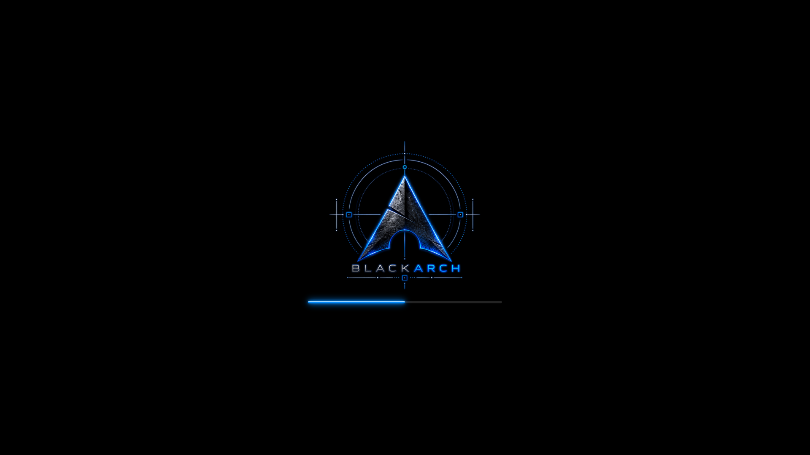

# BlackArch Blue Static Plymouth theme

Uses the supplied static blue BlackArch artwork with a matching glowing loading
bar. Select `blackarch-blue-static` in PoeDeploy's Plymouth theme menu.

Installable archive: [`plymouth/blackarch-blue-static.zip`](plymouth/blackarch-blue-static.zip).

See the [theme documentation](../README.md) for sizing, rebuilding, behaviour,
and artwork provenance. `logo.png` is the unmodified user-supplied source.
