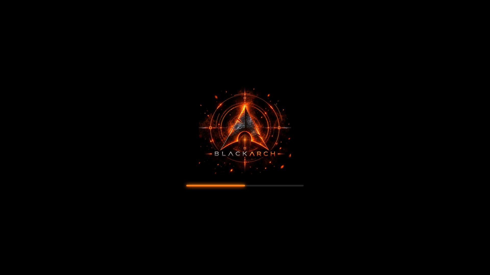

# BlackArch Orange Animated Plymouth theme

Uses the supplied 24-frame orange BlackArch animation at 10 fps with a matching
glowing loading bar and a reduced 360×360 artwork area.
Select `blackarch-orange-animated` in PoeDeploy's Plymouth theme menu.

Installable archive: [`plymouth/blackarch-orange-animated.zip`](plymouth/blackarch-orange-animated.zip).

See the [theme documentation](../README.md) for sizing, rebuilding, behaviour,
and artwork provenance. The animation frames are packaged inside the archive.
