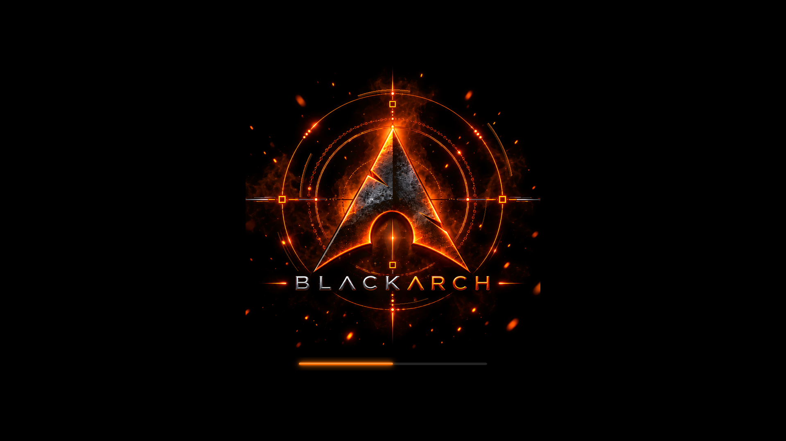

# BlackArch Orange Plymouth theme

Uses the supplied 24-frame orange BlackArch animation at 18 fps with a matching
glowing loading bar.
Select `blackarch-orange` in PoeDeploy's Plymouth theme menu.

Installable archive: [`plymouth/blackarch-orange.zip`](plymouth/blackarch-orange.zip).

See the [theme documentation](../README.md) for sizing, rebuilding, behaviour,
and artwork provenance. The animation frames are packaged inside the archive.
