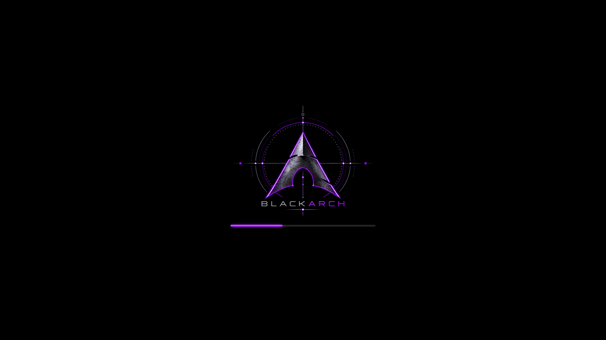

# BlackArch Purple Plymouth theme

Uses the supplied purple BlackArch logo with a matching glowing loading bar.
Select `blackarch-purple` in PoeDeploy's Plymouth theme menu.

Installable archive: [`plymouth/blackarch-purple.zip`](plymouth/blackarch-purple.zip).

This is a capture of Plymouth's X11 renderer at 1920×1080. A deterministic
[50% layout preview](preview.png) is also included.

See the [theme documentation](../README.md) for sizing, rebuilding, behaviour,
and artwork provenance. `logo.png` is the unmodified user-supplied source.
