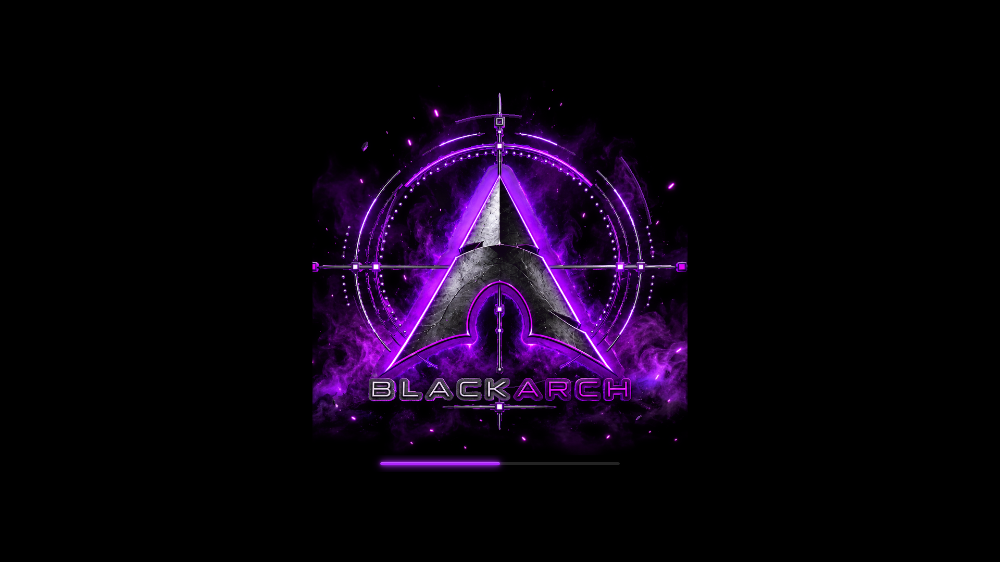

# BlackArch Purple Plymouth theme

Uses the supplied 24-frame purple BlackArch animation at 18 fps with a matching
glowing loading bar.
Select `blackarch-purple` in PoeDeploy's Plymouth theme menu.

Installable archive: [`plymouth/blackarch-purple.zip`](plymouth/blackarch-purple.zip).

See the [theme documentation](../README.md) for sizing, rebuilding, behaviour,
and artwork provenance. The animation frames are packaged inside the archive.
