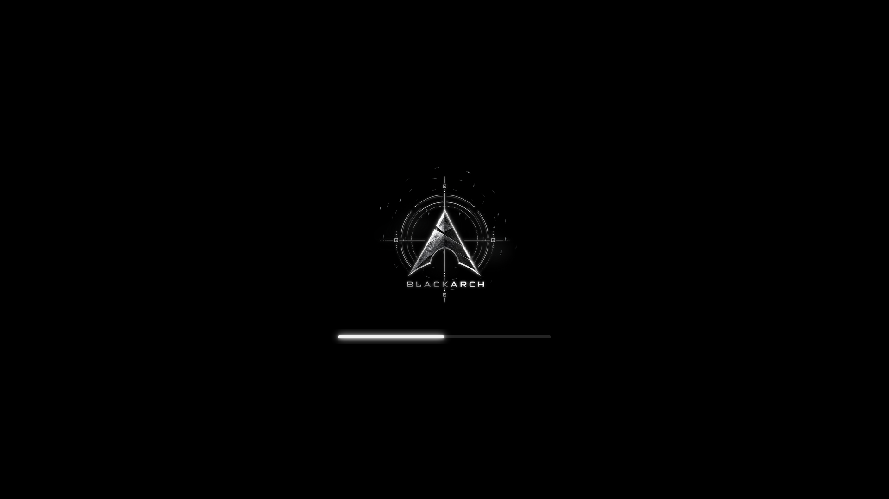

# BlackArch White Animated Plymouth theme

Uses the supplied 96-frame white BlackArch animation at 24 fps with a matching
glowing loading bar and an uncropped 640×360 artwork area.
Select `blackarch-white-animated` in PoeDeploy's Plymouth theme menu.

Installable archive: [`plymouth/blackarch-white-animated.zip`](plymouth/blackarch-white-animated.zip).

See the [theme documentation](../README.md) for sizing, rebuilding, behaviour,
and artwork provenance. The animation frames are packaged inside the archive.
