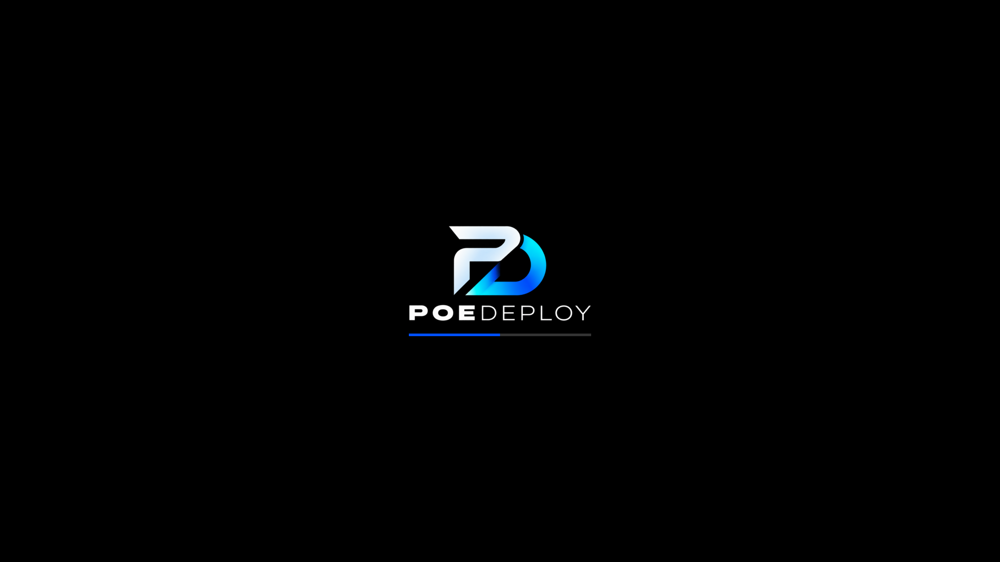

# PoeDeploy Plymouth theme

The official PoeDeploy Plymouth boot animation for Arch Linux.

The installable archive is located at:

```text
plymouth/poedeploy.zip
```

The animation uses the full transparent logo from `../../assets/poedeploy-logo.png`,
including the PoeDeploy name beneath the emblem. The full logo is scaled to
350 pixels wide, with the loading bar 24 pixels below it. Both are part of the
same centred frame, so their spacing stays fixed across display resolutions.

The loading bar uses `#004FFE`, sampled from the blue D in the logo. The native
update/upgrade progress bar uses the same colour. The end animation holds a full
bar until Plymouth exits.

`poedeploy-emblem.png` is retained as the original emblem-only source.

To rebuild the archive and its layout preview, install ImageMagick, zip and unzip,
then run:

```bash
bash themes/poedeploy/build.sh
```

The builder retains the existing password and keyboard prompt assets from the
archive. `preview.png` shows the normal boot layout at 1920×1080; it is a rendered
layout preview, not a capture of a running boot session.



If this theme incorporates third-party material, document its original author, source URL, licence, and required notices here before redistribution.
